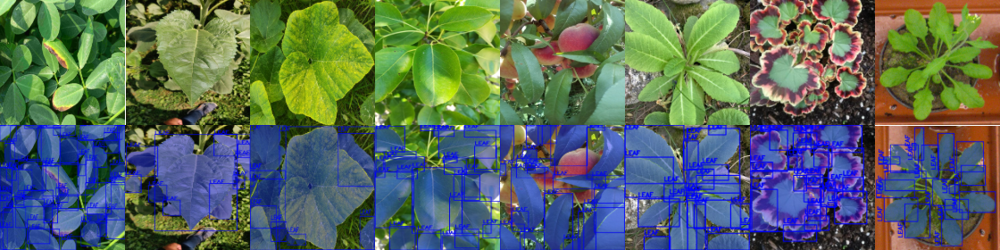

<div align="center">
  
</div>


<div align="center">

## GenYOLO-Leaf: A Data-Centric and Open Source Framework for Generalizable Leaf Instance Segmentation Across Diverse Datasets

</div>
 

<p align="center">
  <a href="https://www.python.org/downloads/release/python-3106/"></a>
  <a href="https://pytorch.org/get-started/previous-versions/"></a>
  <a href="https://developer.nvidia.com/cuda-11-8-0-download-archive/"></a>
  <a href="https://github.com/ultralytics/ultralytics"></a>
  <a href="https://huggingface.co/"></a>
  <a href="https://www.gradio.app/"></a>
  <a href="https://huggingface.co/spaces/aslihanyildirim/genyolo-leaf"></a>
</p>


## 🖋 Abstract

Maintaining plant health is a fundamental concern in many fields, particularly for applications such as disease diagnosis, growth monitoring, and phenotype analysis.  
Despite its importance, existing instance segmentation datasets often suffer from limited diversity in plant species and labeling, resulting in models with restricted generalization ability.  

To address these challenges, this study presents **GenYOLO-Leaf** — a **data-centric**, **open-source** framework developed for instance-level leaf segmentation with enhanced generalizability.  
Leveraging diverse datasets enriched with detailed annotations, GenYOLO-Leaf supports transfer learning and robust segmentation across tasks.  

### 🔑 Key Features

- **🎯 Data-Centric and Generalizable**  
  Built upon the GenYOLO-Leaf framework, this project adopts a data-centric paradigm to address a wide range of applications, including plant phenotyping, disease detection, growth monitoring, leaf counting, leaf grafting, and background removal. The framework emphasizes generalization across diverse domains.

- **⚡ Efficient Transfer Learning Resource**  
  Pre-trained models and weights are openly provided, enabling efficient adaptation to new tasks with significantly reduced training and inference costs.

- **🛠 Zero-Shot Benchmarking Across Datasets**  
  The framework has been rigorously evaluated through zero-shot benchmarking across eight widely used public datasets, demonstrating its robustness and adaptability to various segmentation scenarios.

- **🤝 Community-Supported and Hardware-Compatible**  
  Designed for compatibility with a variety of hardware configurations, the framework is supported by an active open-source community, facilitating scalability, extensibility, and collaborative development.

- **🌐 Open Access and Extensibility**  
  The full framework, including source code and pre-trained weights, is publicly available to encourage reproducibility, transparency, and continued innovation within the research community.


---


## 🧠 Examples of Train Datasets
An overview of the training datasets and the number of extracted instances used in the GenYOLO-Leaf framework is provided below.

| **Training Dataset** | **Image Count** | **Plant**              | **Classes** | **Purpose**                     | **Extracted Instances** |
|----------------------|-----------------|------------------------|-------------|----------------------------------|--------------------------|
| [Plant Pathology 2021](https://www.kaggle.com/competitions/plant-pathology-2021-fgvc8) | 18,632 | Apple                 | 5 | Disease Classification          | 58,496 |
| [DiaMOS](https://zenodo.org/records/5557313) | 3,006 | Pear | 4 | Disease Classification | 26,900 |
| [Peach Dataset](https://data.mendeley.com/datasets/3pmj85snvw/1) | 400 | Peach | 6 | Disease Classification | 4,901 |
| [Pumpkin Leaf Disease](https://data.mendeley.com/datasets/wtxcw8wpxb/1) | 2,000 | Pumpkin | 4 | Disease Classification | 6,403 |
| [Sunflower](https://data.mendeley.com/datasets/b83hmrzth8/1) | 390 | Sunflower | 3 | Disease Classification | 1,151 |
| [CVPPP 2017](https://www.plant-phenotyping.org/datasets-home) | 933 | Tobacco & Arabidopsis | 2 | Counting and Segmentation | 8,050 |
| [GroundNut](https://data.mendeley.com/datasets/x6x5jkk873/2) | 1,176 | Ground Nut | 5 | Disease Classification | 14,931 |
| [Betel Leaf](https://data.mendeley.com/datasets/g7fpgj57wc/2) | 750 | Betel Leaf | 4 | Disease Classification | 1,170 |
| [Pl@ntNet 300K - Sample](https://zenodo.org/records/4726653) | 3,017 | Various | Multiple | Plant and Leaf Classification | 23,393 |
| **Total** | **30,314** | -- | -- | -- | **145,395** |


The visual representing our data and labels, which include 9 different plant species and different plant tasks, is as follows:
<div align="center">
  


</div>

---

## 📊 Initial Benchmarks and Models

For segmentation [Ultralytics](https://github.com/ultralytics/ultralytics) Yolov11 and Yolov8 used in this study. If you want to use models, follow the Ultralytics instructions. The initial benchmarks obtained for five different variants of models across nine distinct datasets are presented in the table below:

<p align="center">

## YOLOv11 Benchmarking Results on Validation Dataset

| Model       | Prec (YOLOv11) | Rec (YOLOv11) | mAP50 (YOLOv11) | mAP50–95 (YOLOv11) |
|-------------|----------------|---------------|-----------------|--------------------|
| [YOLO11x-seg](https://github.com/aaslihanyildirim/GenYOLO-Leaf/releases/download/shared_best_models/genyolo_leaf_yolov11x.pt) | 0.935          | 0.929         | 0.967           | 0.880              |
| [YOLO11l-seg](https://github.com/aaslihanyildirim/GenYOLO-Leaf/releases/download/shared_best_models/genyolo_leaf_yolov11l.pt)       | 0.894          | 0.889         | 0.952           | 0.854              |
| [YOLO11m-seg](https://github.com/aaslihanyildirim/GenYOLO-Leaf/releases/download/shared_best_models/genyolo_leaf_yolov11m.pt)      | 0.891          | 0.880         | 0.949           | 0.851              |
| [YOLO11s-seg](https://github.com/aaslihanyildirim/GenYOLO-Leaf/releases/download/shared_best_models/genyolo_leaf_yolov11s.pt)       | 0.859          | 0.859         | 0.932           | 0.825              |
| [YOLO11n-seg](https://github.com/aaslihanyildirim/GenYOLO-Leaf/releases/download/shared_best_models/genyolo_leaf_yolov11n.pt)       | 0.840          | 0.825         | 0.912           | 0.797              |

## YOLOv8 Initial Benchmarking Results on Validation Dataset

| Model       | Prec (YOLOv8) | Rec (YOLOv8) | mAP50 (YOLOv8) | mAP50–95 (YOLOv8) |
|-------------|---------------|--------------|----------------|-------------------|
| [YOLOv8x-seg](https://github.com/aaslihanyildirim/GenYOLO-Leaf/releases/download/shared_best_yolov8_models/genyolo_leaf_yolov8x.pt) | 0.828         | 0.820        | 0.910          | 0.801             |
| [YOLOv8l-seg](https://github.com/aaslihanyildirim/GenYOLO-Leaf/releases/download/shared_best_yolov8_models/genyolo_leaf_yolov8l.pt)       | 0.827         | 0.817        | 0.909          | 0.798             |
| [YOLOv8m-seg](https://github.com/aaslihanyildirim/GenYOLO-Leaf/releases/download/shared_best_yolov8_models/genyolo_leaf_yolov8m.pt)      | 0.828         | 0.817        | 0.908          | 0.795             |
| [YOLOv8s-seg](https://github.com/aaslihanyildirim/GenYOLO-Leaf/releases/download/shared_best_yolov8_models/genyolo_leaf_yolov8s.pt)       | 0.833         | 0.835        | 0.916          | 0.805             |
| [YOLOv8n-seg](https://github.com/aaslihanyildirim/GenYOLO-Leaf/releases/download/shared_best_yolov8_models/genyolo_leaf_yolov8n.pt)        | 0.822         | 0.798        | 0.895          | 0.771             |

</p>

---

## 🧪 Examples of Zero-Shot Evaluation on Instance Segmentation Datasets

Instance segmentation datasets, the first column images, the second column ground truth masks, the third column masks predicted by YOLOv11 best model and the fourth column masks predicted by Yolov8 are shown in the figure below, respectively.

<div align="center">


</div>

---

## 🧪 Examples of Zero-Shot Evaluation on Semantic Segmentation Datasets

Semantic segmentation datasets, the first column images, the second column ground truth masks, the third column masks predicted by YOLOv11 best model and the fourth column masks predicted by Yolov8 are shown in the figure below, respectively.

<div align="center">


</div>

---
## 🖥️ Interactive Leaf Instance Segmentation App

You can try out the instance leaf segmentation tool we developed using [Hugginface](https://huggingface.co/)'s [Gradio](https://huggingface.co/) server. [Here](https://huggingface.co/spaces/aslihanyildirim/genyolo-leaf), you can run tests on three main screens for all the data-driven YOLO versions we've developed. To run it on your local computer, you must download the included files and follow the instructions.

<div align="center">


</div>

### 🔎 Inference Screen

On the Inference screen, you can upload the image you want to test and set the desired model and confidence threshold. The output will show the instance segmentation mask overlay and binary mask.

<div align="center">


</div>

###  📊 Evaluation Screen

On the Evaluation screen, you can upload the image you want to test and its corresponding ground truth mask format, and then view the results of the instance segmentation metrics obtained from the prediction.

<div align="center">


</div>

###  📈 Model Comparision Screen

On the Evaluation screen, you can upload the image you want to test and its corresponding ground truth mask, select the models you want to compare, and view a graph comparing various models in terms of instance segmentation metrics.

<div align="center">


</div>

---
## 📖 Citation

If you use **GenYOLO-Leaf** in your research, please cite our [research paper](https://link.springer.com/article/10.1007/s00371-025-04351-4):

```bibtex
@article{Yildirim2026GenYOLOLeaf,
  title   = {GenYOLO-leaf: a data-centric and open source framework for generalizable leaf instance segmentation across diverse datasets},
  author  = {Y{\i}ld{\i}r{\i}m, Asl{\i}han and Terzi, Ramazan},
  journal = {The Visual Computer},
  year    = {2026},
  volume  = {42},
  number  = {2},
  pages   = {145--145},
  doi     = {10.1007/s00371-025-04351-4},
  url     = {https://doi.org/10.1007/s00371-025-04351-4},
}

