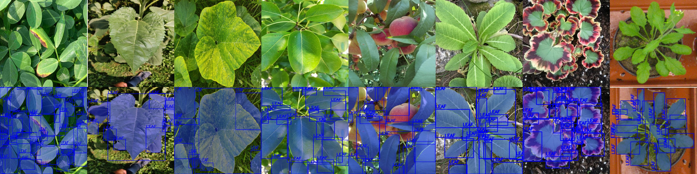
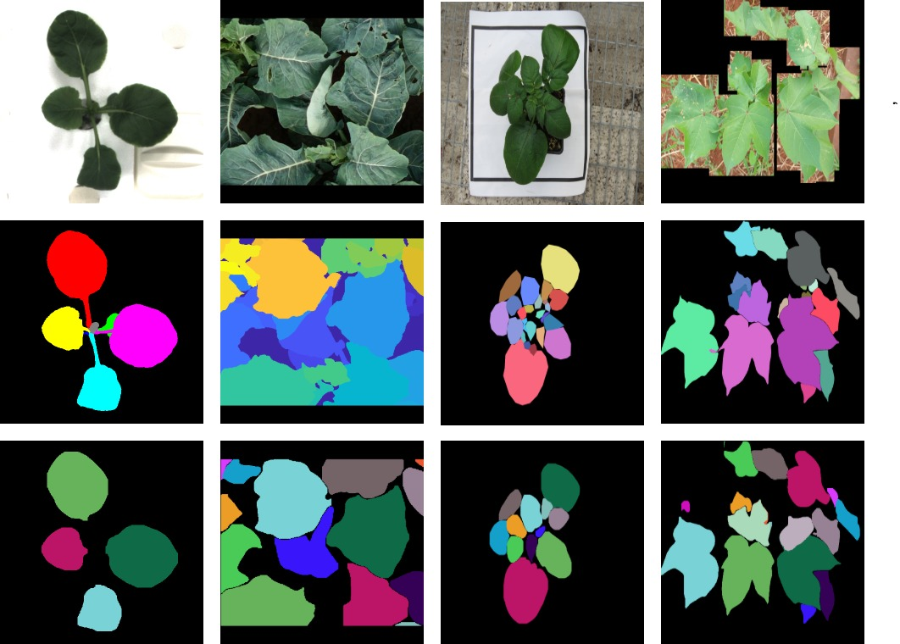
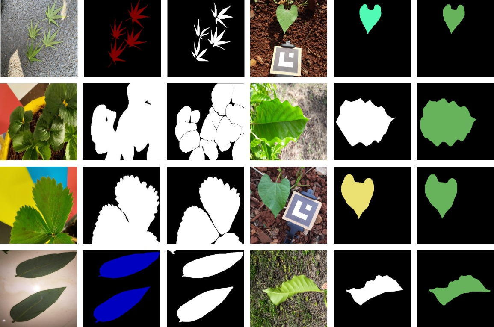

  

## 🌿GenYOLO-LEAF: A Data-Centric and Open Source Framework for Generalizable Leaf Instance Segmentation Across Diverse Datasets  

## 🖋 Abstract

Maintaining plant health is a fundamental concern in many fields, particularly for applications such as disease diagnosis, growth monitoring, and phenotype analysis.  
Despite its importance, existing instance segmentation datasets often suffer from limited diversity in plant species and labeling, resulting in models with restricted generalization ability.  

To address these challenges, this study presents **GenYOLO-Leaf** — a **data-centric**, **open-source** framework developed for instance-level leaf segmentation with enhanced generalizability.  
Leveraging diverse datasets enriched with detailed annotations, GenYOLO-Leaf supports transfer learning and robust segmentation across tasks.  

### 🔑 Key Features

- **🎯 Data-Centric and Generalizable**  
  Built upon the GenYOLO-Leaf framework, this project adopts a data-centric paradigm to address a wide range of applications, including plant phenotyping, disease detection, growth monitoring, leaf counting, leaf grafting, and background removal. The framework emphasizes generalization across diverse domains.

- **⚡ Efficient Transfer Learning Resource**  
  Pre-trained models and weights are openly provided, enabling efficient adaptation to new tasks with significantly reduced training and inference costs.

- **🛠 Zero-Shot Benchmarking Across Datasets**  
  The framework has been rigorously evaluated through zero-shot benchmarking across eight widely used public datasets, demonstrating its robustness and adaptability to various segmentation scenarios.

- **🤝 Community-Supported and Hardware-Compatible**  
  Designed for compatibility with a variety of hardware configurations, the framework is supported by an active open-source community, facilitating scalability, extensibility, and collaborative development.

- **🌐 Open Access and Extensibility**  
  The full framework, including source code and pre-trained weights, is publicly available to encourage reproducibility, transparency, and continued innovation within the research community.

---

## 🧠 Examples of Train Datasets
An overview of the training datasets and the number of extracted instances used in the GenYOLO-Leaf framework is provided below.

| **Training Dataset** | **Image Count** | **Plant**              | **Classes** | **Purpose**                     | **Extracted Instances** |
|----------------------|-----------------|------------------------|-------------|----------------------------------|--------------------------|
| [Plant Pathology 2021](https://www.kaggle.com/competitions/plant-pathology-2021-fgvc8) | 18,632 | Apple                 | 5 | Disease Classification          | 58,496 |
| [DiaMOS](https://zenodo.org/records/5557313) | 3,006 | Pear | 4 | Disease Classification | 26,900 |
| [Peach Dataset](https://data.mendeley.com/datasets/3pmj85snvw/1) | 400 | Peach | 6 | Disease Classification | 4,901 |
| [Pumpkin Leaf Disease](https://data.mendeley.com/datasets/wtxcw8wpxb/1) | 2,000 | Pumpkin | 4 | Disease Classification | 6,403 |
| [Sunflower](https://data.mendeley.com/datasets/b83hmrzth8/1) | 390 | Sunflower | 3 | Disease Classification | 1,151 |
| [CVPPP 2017](https://www.plant-phenotyping.org/datasets-home) | 933 | Tobacco & Arabidopsis | 2 | Counting and Segmentation | 8,050 |
| [GroundNut](https://data.mendeley.com/datasets/x6x5jkk873/2) | 1,176 | Ground Nut | 5 | Disease Classification | 14,931 |
| [Betel Leaf](https://data.mendeley.com/datasets/g7fpgj57wc/2) | 750 | Betel Leaf | 4 | Disease Classification | 1,170 |
| [Pl@ntNet 300K - Sample](https://zenodo.org/records/4726653) | 3,017 | Various | Multiple | Plant and Leaf Classification | 23,393 |
| **Total** | **30,314** | -- | -- | -- | **145,395** |

The visual representing our data and labels, which include 9 different plant species and different plant tasks, is as follows:

  

---

## 📊 Initial Benchmarks and Models

For segmentation [Ultralytics](https://github.com/ultralytics/ultralytics) Yolov11 used in this study. If you want to use models, follow the Ultralytics instructions. The initial benchmarks obtained for five different variants of Yolov11 across nine distinct datasets are presented in the table below:

| **Model** | **Seg. Prec** | **Seg. Rec** | **Seg. mAP50** | **Seg. mAP50–95** | **Box Prec** | **Box Rec** | **Box mAP50** | **Box mAP50–95** |
|----------|---------------|--------------|----------------|-------------------|--------------|-------------|----------------|-------------------|
| [Extra Large](https://github.com/aaslihanyildirim/GenYOLO-Leaf/releases/download/shared_best_models/best_x.pt) | 0.9348 | 0.9282 | 0.9665 | 0.8790 | 0.9364 | 0.9289 | 0.9692 | 0.9141 |
| [Large](https://github.com/aaslihanyildirim/GenYOLO-Leaf/releases/download/shared_best_models/best_l.pt)       | 0.8932 | 0.8886 | 0.9511 | 0.8536 | 0.8938 | 0.8896 | 0.9529 | 0.8861 |
| [Medium](https://github.com/aaslihanyildirim/GenYOLO-Leaf/releases/download/shared_best_models/best_m.pt)      | 0.8902 | 0.8792 | 0.9482 | 0.8504 | 0.8909 | 0.8800 | 0.9500 | 0.8810 |
| [Small](https://github.com/aaslihanyildirim/GenYOLO-Leaf/releases/download/shared_best_models/best_s.pt)       | 0.8582 | 0.8585 | 0.9319 | 0.8246 | 0.8574 | 0.8578 | 0.9320 | 0.8522 |
| [Nano](https://github.com/aaslihanyildirim/GenYOLO-Leaf/releases/download/shared_best_models/best_n.pt)        | 0.8393 | 0.8243 | 0.9119 | 0.7968 | 0.8397 | 0.8222 | 0.9117 | 0.8218 |

---

## 🧪 Examples of Zero-Shot Evaluation on Instance Segmentation Datasets

Instance segmentation datasets, the first row images, the second row ground truth masks and the third row masks predicted by the model are shown in the figure below, respectively.

---

## 🧪 Examples of Zero-Shot Evaluation on Semantic Segmentation Datasets

Semantic segmentation datasets, the first column images, the second column ground truth masks and the third column masks predicted by the model are shown in the figure below, respectively.

---

## 📖 Citation

If you are going to use the published weights within the scope of this study, please cite the original article. to be added
